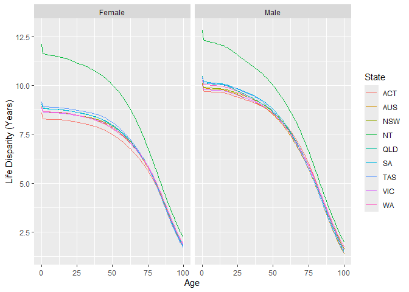
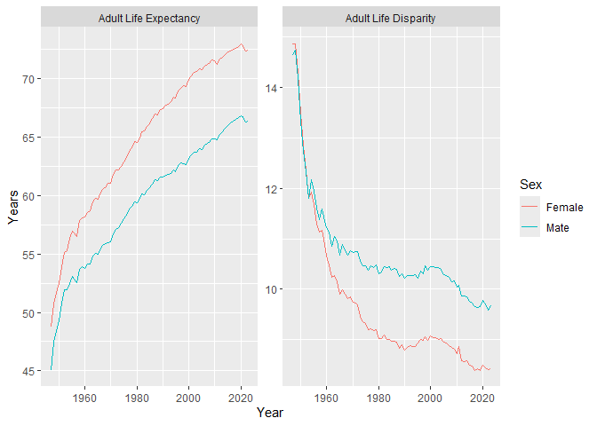

<!-- README.md is generated from README.Rmd. Please edit that file -->

# ltxtra

<!-- badges: start -->

[](https://github.com/sdyrting/ltxtra/actions/workflows/R-CMD-check.yaml)
<!-- badges: end -->

An R package for calculating non-standard life table variables

## Installation

You can install the development version of ltxtra from
[GitHub](https://github.com/) with:

``` r
# install.packages("pak")
pak::pak("sdyrting/ltxtra")
```

<!--
To install ltxtra from its tarball, change working directory to directory of the tarball and enter the following in the R console.
&#10;``` r
# install.packages('devtools') ## Install devtools if you don't have it
devtools::install_local('./ltxtra-0.0.0.9000.tar.gz')
```
-->

## Example 1: Adding life disparity to a life table

This is a basic example which shows you how to solve a common problem:

``` r
library(ltxtra)
library(dplyr)
#> Warning: package 'dplyr' was built under R version 4.4.3
#> 
#> Attaching package: 'dplyr'
#> The following objects are masked from 'package:stats':
#> 
#>     filter, lag
#> The following objects are masked from 'package:base':
#> 
#>     intersect, setdiff, setequal, union
library(ggplot2)
#> Warning: package 'ggplot2' was built under R version 4.4.3

head(aus_2021_2023 %>% select(!c(mx,ax)))
#> # A tibble: 6 × 10
#> # Groups:   State, Sex [1]
#>   State Sex      Age      qx      lx     dx    Lx      Tx    ex OpenInterval
#>   <chr> <chr>  <dbl>   <dbl>   <dbl>  <dbl> <dbl>   <dbl> <dbl> <lgl>       
#> 1 NSW   Female     0 0.00251 100000  251    99772 8521447  85.2 FALSE       
#> 2 NSW   Female     1 0.00019  99749   19.0  99739 8421675  84.4 FALSE       
#> 3 NSW   Female     2 0.00011  99730.  11.0  99724 8321936  83.4 FALSE       
#> 4 NSW   Female     3 0.00009  99719.   8.97 99715 8222212  82.5 FALSE       
#> 5 NSW   Female     4 0.00008  99710.   7.98 99706 8122497  81.5 FALSE       
#> 6 NSW   Female     5 0.00007  99702.   6.98 99698 8022791  80.5 FALSE

daus_lt <- aus_2021_2023 %>% group_by(State,Sex) %>% lifedisp()

head(daus_lt %>% select(!c(mx,ax)))
#> # A tibble: 6 × 11
#> # Groups:   State, Sex [1]
#>   State Sex      Age      qx     lx     dx    Lx     Tx    ex OpenInterval    vx
#>   <chr> <chr>  <dbl>   <dbl>  <dbl>  <dbl> <dbl>  <dbl> <dbl> <lgl>        <dbl>
#> 1 NSW   Female     0 0.00251 1   e5 251    99772 8.52e6  85.2 FALSE         8.86
#> 2 NSW   Female     1 0.00019 9.97e4  19.0  99739 8.42e6  84.4 FALSE         8.67
#> 3 NSW   Female     2 0.00011 9.97e4  11.0  99724 8.32e6  83.4 FALSE         8.65
#> 4 NSW   Female     3 0.00009 9.97e4   8.97 99715 8.22e6  82.5 FALSE         8.64
#> 5 NSW   Female     4 0.00008 9.97e4   7.98 99706 8.12e6  81.5 FALSE         8.64
#> 6 NSW   Female     5 0.00007 9.97e4   6.98 99698 8.02e6  80.5 FALSE         8.63

daus_lt %>% ggplot() +
  geom_line(aes(x=Age,y=vx,group=State,colour=State)) +
  labs(y='Life Disparity (Years)')+
  facet_wrap(vars(Sex))
```

 \## Example
2

`ltxtra` assumes life tables are in same form as those produced by the
`HMDHFDplus` package. This makes it easy to import and decorate life
tables from the Human Mortality Database and associated subnational
databases.

``` r
library(tidyverse)
#> Warning: package 'tidyverse' was built under R version 4.4.2
#> Warning: package 'tibble' was built under R version 4.4.3
#> Warning: package 'tidyr' was built under R version 4.4.3
#> Warning: package 'readr' was built under R version 4.4.2
#> Warning: package 'purrr' was built under R version 4.4.2
#> Warning: package 'stringr' was built under R version 4.4.3
#> Warning: package 'forcats' was built under R version 4.4.2
#> Warning: package 'lubridate' was built under R version 4.4.2
#> ── Attaching core tidyverse packages ──────────────────────── tidyverse 2.0.0 ──
#> ✔ forcats   1.0.0     ✔ stringr   1.5.2
#> ✔ lubridate 1.9.3     ✔ tibble    3.2.1
#> ✔ purrr     1.0.2     ✔ tidyr     1.3.1
#> ✔ readr     2.1.5     
#> ── Conflicts ────────────────────────────────────────── tidyverse_conflicts() ──
#> ✖ dplyr::filter() masks stats::filter()
#> ✖ dplyr::lag()    masks stats::lag()
#> ℹ Use the conflicted package (<http://conflicted.r-lib.org/>) to force all conflicts to become errors
library(HMDHFDplus)
#> Warning: package 'HMDHFDplus' was built under R version 4.4.3
library(ltxtra)
library(ggplot2)

prefID <- '00' #All Japan

jpn_lt <- readJMDweb(prefID,"fltper_1x1") %>% 
  mutate(Sex = 'Female') %>%
  bind_rows(readJMDweb(prefID,"mltper_1x1") %>% 
  mutate(Sex = 'Mate')) %>%
  group_by(Year,Sex) %>% lifedisp()

adult_age <- 15 

jpn_lt %>% mutate(Country='Japan') %>% 
  filter(Age == adult_age) %>% 
  pivot_longer(cols=c(ex,vx)) %>%
  mutate(name=ifelse(name == 'ex', 'Adult Life Expectancy','Adult Life Disparity'),
         name=factor(name,levels=c('Adult Life Expectancy','Adult Life Disparity'))) %>%
  ggplot() + 
  geom_line(aes(x=Year,y=value, group=Sex,colour=Sex)) +
  facet_wrap(facets=vars(name),ncol=2,scales='free') +
  labs(y='Years')
```

<div class="figure">


<p class="caption">

Japanese Adult Life Expectancy and Disparity by Year and Sex
</p>

</div>

<!--
What is special about using `README.Rmd` instead of just `README.md`? You can include R chunks like so:
&#10;
``` r
summary(cars)
#>      speed           dist       
#>  Min.   : 4.0   Min.   :  2.00  
#>  1st Qu.:12.0   1st Qu.: 26.00  
#>  Median :15.0   Median : 36.00  
#>  Mean   :15.4   Mean   : 42.98  
#>  3rd Qu.:19.0   3rd Qu.: 56.00  
#>  Max.   :25.0   Max.   :120.00
```
&#10;You'll still need to render `README.Rmd` regularly, to keep `README.md` up-to-date. `devtools::build_readme()` is handy for this.
&#10;You can also embed plots, for example:
&#10;
&#10;In that case, don't forget to commit and push the resulting figure files, so they display on GitHub and CRAN.
-->
